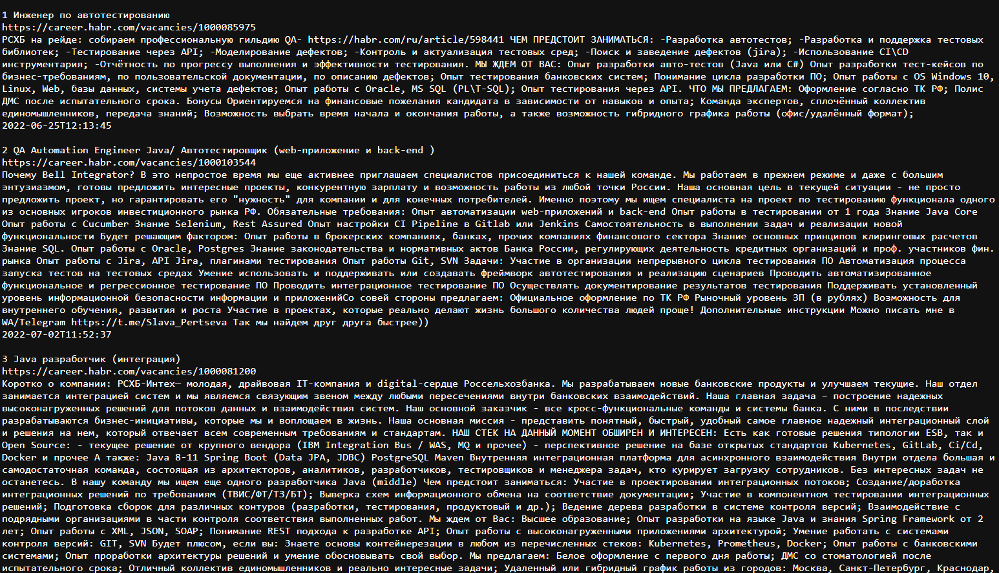

# Job grabber

### About the application

+ Web application **"Job Aggregator"** in Java for parsing vacancies from the specified site.  
+ Reads all Java vacancies and writes to the database.
+ System starts on schedule. The start period is specified in the settings - app.properties.
+ The first site will [career.habr.com](https://career.habr.com/ "go to career.habr.com"). It has a vacancies section.
+ REST API access to the interface.

### Expandability

1. Add new sites without changing the code.
2. Parallel site parsing.

## Technology stack:
```text
+ Java 17;
+ Maven 4.0;
+ PostgreSQL 14;
+ JDBC;
+ Liquibase;
+ Log4j;
+ JaCoCo
+ Checkstyle
```
## Application launch:

1. Install PostgreSQL: login - postgres, password - password;
2. Create database schema;
    ```postgres-sql
    CREATE DATABASE schema;
    ```
3. Build the project and run the application
    ```shell
    mvn clean compile exec:java -Dexec.mainClass="ru.job4j.grabber.Grabber"
   ```
## Application use:
+ Get vacancies list http://localhost:9000/  
  

### Contacts
+ email: [oywayten+git@gmail.com](mailto:oywayten+git@gmail.com)
+ telegram: [@VitaliyJVM](https://t.me/VitaliyJVM/ "go to t.me/VitaliyJVM")